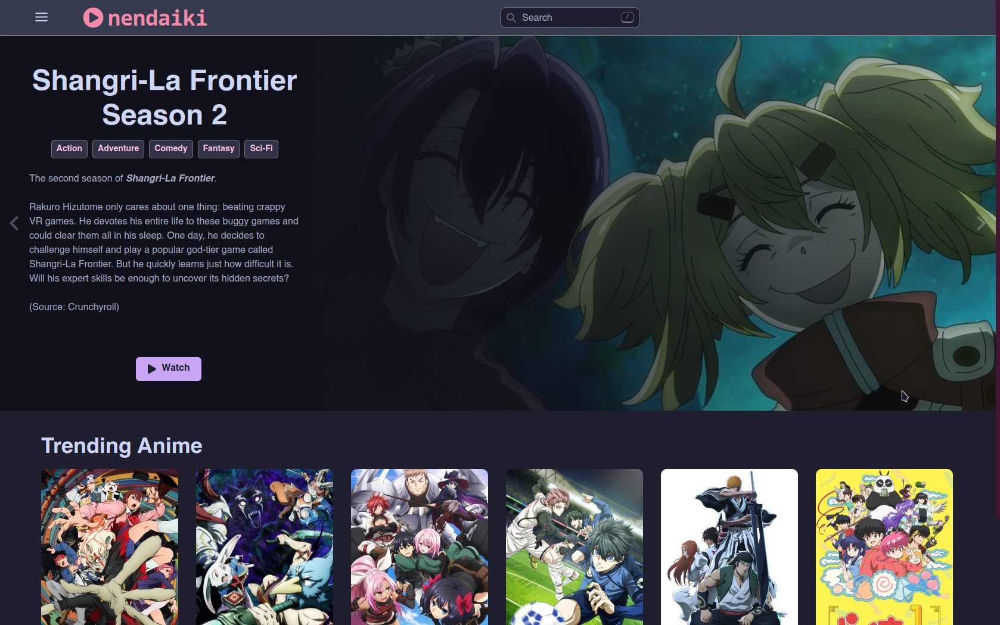

# Nendaiki

Nendaiki is a Electron-based anime-streaming application using the Consumet API.



## Table of Contents

- [Features](#features)
- [Installation](#installation)
- [TODO](#todo)

## Features

- **Simple, Sleek Interface**: Users can easily navigate throughout the app and explore different anime.
- **History Tracking**: Previously watched anime is kept track of and can be deleted.
- **Cross-Platform Compatibility**: Nendaiki is supported on Windows, Mac, and Linux.
- **Fast**: Anime and episodes are cached to prevent re-loading.

## Installation

### Prerequisites

- Node.js and npm
- Electron

### Steps

1. Clone the repository

    ```bash
    git clone https://github.com/ethanloh8/nendaiki.git
    cd nendaiki
    ```

2. Install dependencies

    ```bash
    npm install
    ```

3. Build the application

    ```bash
    # for windows
    npm run build:windows
    # for mac
    npm run build:mac
    # for linux
    npm run build:linux
    ```

### Development Mode

To start the application in development mode, run:

```bash
npm run dev
```

This will start the app on http://localhost:5173.

## TODO
- [ ] Anilist integration
- [ ] Local anime list
- [ ] Export data
